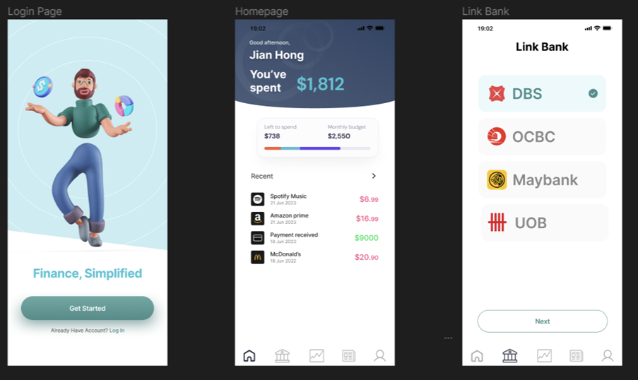
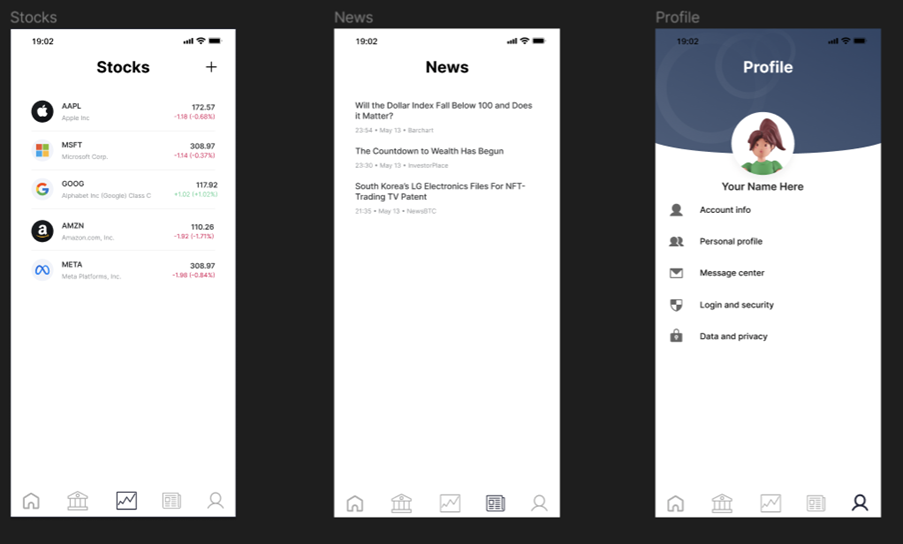
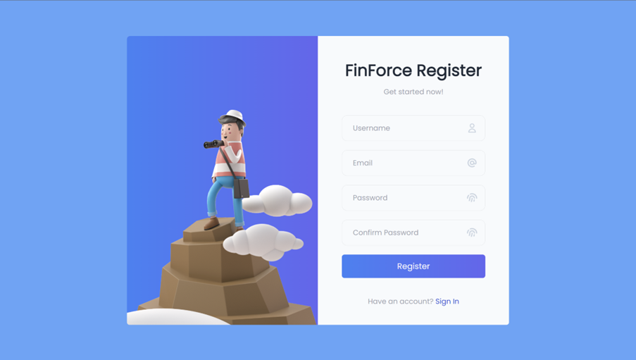
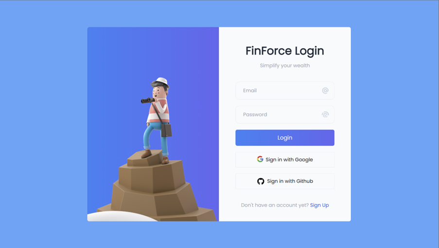
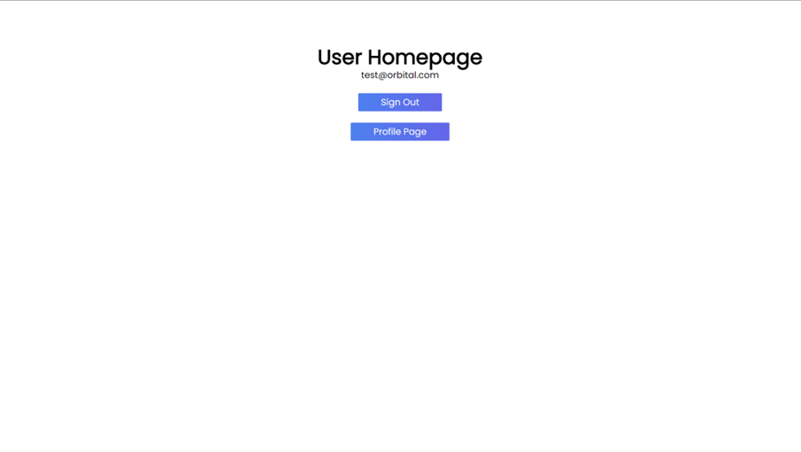
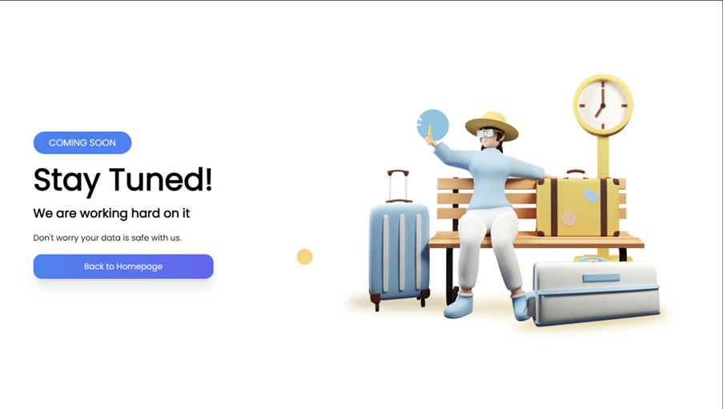

# FinForce (5845)

## Link to Documentation

## Motivation
One of the primary challenges with existing personal budgeting applications is **their reliance on manual input of data**, which can lead to inaccuracies and inconsistencies due to human error. People often forget to log their expenses or may enter incorrect information, resulting in an inaccurate representation of their financial situation. We believe that in this generation of rising automata, manually logging every single one of our spending is considered tedious and redundant, and there are better solutions to counter this problem.

Another challenge faced by students and young professionals is the **fragmentation of financial management tools**. As stock investing is being taught more frequently in universities, and students are taking an increasing interest in it, especially when most people can just access trading platforms just with their phones. However, individuals often need to rely on multiple apps to manage different aspects of their finances, such as budgeting, expense tracking, and stock investing. This fragmentation can result in a disjointed experience and may discourage users from effectively managing their finances. We believe that all of these functionalities could be converged into a single place instead of all over the place and having to keep track with app is for what.

## Aim
**Our goal for our Orbital project is to develop a unified app for personal finance management and stock tracking**. Personal finance tracking is an essential component of the app, as it enables users to monitor their expenses, set budgets, and work towards their financial goals. **Integration with open banking APIs** will allow for real-time tracking of account balances and transactions, ensuring accurate and up-to-date information.

In addition to personal finance management, the app will offer **stock tracking features**, such as customizable watchlists and portfolio performance monitoring. Notifications will keep users informed about significant market events and updates, helping them make timely and well-informed investment decisions.

As an extension, **gamification elements** will be incorporated to encourage good financial habits and user engagement. By setting personal and group challenges, users can motivate themselves and others to stay on track with their financial goals and compete in a friendly, collaborative environment.

In future, the app could include advanced features, such as **communities and forums** where users can share tips and insights on personal wealth management and investment ideas. These interactive spaces will facilitate knowledge sharing and foster a supportive network for users to learn from one another.

## User Stories
1. As a user, I want to be able to track my daily expense and income in real-time so that I can have a better understanding of my spending habits.
2. As a user, I want to be able to connect my bank accounts to the app, so that I can have a comprehensive view of my financial situation without the need of switching back and forth from multiple apps.
3. As a user, I want to be able to securely store and organize important financial documents, such as receipts, invoices, and tax documents, within the app, so I can easily access them whenever needed.
4. As a user, I want the app to have a user-friendly interface and intuitive design, making it easy for me to navigate and access all features, regardless of my level of financial expertise.
5. As a user, I want to keep track of my investment portfolio/watchlist of multiple kinds of investments, such as stocks, cryptocurrency, bonds, forex, etc in a single app and be notified if there’s a major change on my portfolio/watchlist.
6. As a user, I want to be motivated to manage my wealth and form good financial habits regarding personal finance by making the process fun.
7. As a user, I want to be able to participate in forums and discussions on personal wealth and finance so that I can learn from others and share my own experiences.

## Project Scope
#### Part 1: App Prototype
1. Develop wireframe and design UI/UX
	Create wireframes for the pages below:
	- Home Page
		 The page where all the income and expense information are showed according to the timeline, with the latest on top. This is the page for the users to add and manage all their expense and income.
		 
	- Bank Account Page
		 The page to track the user’s bank accounts balance and transactions.
		 
	- Stocks Page
		 The page for the user to track their stocks of preference and analysis of the stocks.
		 
	- News Page
		 The page that shows the financial news and articles.
		 
	- Profile Page
		 The page that shows the users’ personal information, and the ranks and achievements for the gamification elements.

2. User Authentication and Onboarding
	- Develop a user registration feature
		 Implement the user registration and authentication using secure authentication protocols.
		 
	- Develop a profile page for user's personal information
		 Implement a profile section where users can add and change their personal information.
		 
	- Develop a feature to link the user bank account
		 Implement a feature to allow the users to link their bank accounts via open banking API to track their transactions.

3. Testing and Quality Assurance
	- Conduct unit testing to ensure that individual components of the app are functioning correctly
	- Perform integration testing to test how different components of the app interact with each other
	- Conduct usability testing to identify and resolve any usability issues in the application’s design
	- Implement error handling and logging to help diagnose and fix any issues that may arise during the testing phase

#### Part 2: Core functionality
1. Personal Finance Tracking
	- Implement expense and income tracking feature
		 Users can add their expense or income by adding the name, amount, and label of the expense or income.
		 
	- Develop a feature that allows users to categorize their expenses and income
		 Implement label, which the user can create a label by setting the label name and colour manually. The label is used to categorize the expense and income.
		 
	- Develop a feature to set personal budgets and goals
		 Implement a personal budget feature, where the user can track their progress towards their financial targets. This feature can show the user the remaining budget for the month, and the amount of expense per day to keep the expense within the budget.
		 
	- Develop a feature for the user to monitor their bank account
		 Implement a bank account monitoring feature, where the user can check their bank account balance and transactions history on the app. This is done by using the open banking API provided by the banks.
		 
2. Stocks Tracking
	- Develop a stocks watchlist feature
		 Implement a stock watchlist, the users can monitor the performance of stocks they are interested in using the watchlist. Users can add and remove the stocks of their preference to the watchlist.
		 
	- Develop a real-time stock price tracking
		 Implement a real-time stock price tracking, the users can track the stock prices in real time and keep up to date on the market changes.
		 
	- Develop a feature to perform in-depth analysis of individual stocks
		 Implement a stock analysis feature for the user to analyse the stocks. This is implemented by using the widget from Trading View widget.
		 
	- Develop a feature to notify users of significant event on their investments
		 Implement a notification for the users that alert the users on significant events that may impact their investment. The user can add and remove the notification and the type of events manually. The events include: a stock that hit a certain price point, a stock that has exceeded a change of price in a period.

3. Testing and Quality Assurance
	- Conduct unit testing to ensure that individual components of the app are functioning correctly
	- Perform integration testing to test how different components of the app interact with each other
	- Conduct usability testing to identify and resolve any usability issues in the application’s design
	- Implement error handling and logging to help diagnose and fix any issues that may arise during the testing phase

#### Part 3: Additional Features
1. Finalize User Interface Design
	- Finalize the overall user interface design of the application, the design is consistent across all the pages of the application.

2. News Page
	 - Develop a news page with financial news and analysis
		 Implement the news page, where the users can find financial news and market analysis. The news articles are pulled from news API.

	- Develop a mood indicator  
		 Implement a mood indicator that represents the sentiment of the news during that day using web crawler to parse the news and analyze it using NLTK python (tentative).

	- Develop a notification for relevant news to the user
		 Implement a notification for the user that alert the users on news that are relevant to the user. User can turn on the notification based on their preference of the type of news and the frequency of the notifications.
		 
3. Gamification Features
	- Develop the gamification elements
		 Implement the gamification elements, create personal financial goals challenges to encourage the users to form good financial habits. The examples of the goals are: users kept their expenses within the budget, users keep track their expenses regularly, streaks (hitting the same goal multiple times consecutively.

	- Develop a point-based system to track progress
		 Implement the point-based system, to track the progress of the users and incentivize continued engagement with the app. There are different ranks for the points, users who hit a certain point can unlock a new rank and unlock new badges.
		 
1. Testing and Quality Assurance
	- Conduct unit testing to ensure that individual components of the app are functioning correctly
	- Perform integration testing to test how different components of the app interact with each other
	- Conduct usability testing to identify and resolve any usability issues in the application’s design
	- Implement error handling and logging to help diagnose and fix any issues that may arise during the testing phase


## Tech Stack
1. Frontend: NextJS, ReactJS
2. Backend: NodeJS
3. Database: Firebase
4. Authentication and Authorization: JWT
5. Stock Market Data API: TradingView
6. Crypto Market Data API: Polygon
7. Testing: Postman
8. NLP: NLTK Python / NLP.js / Natural

## Timeline
| No | Task                       | Status     |
|----|----------------------------|------------|
|          | Sprint 1 (1 May - 14 May)     |             |
| 1  | Sprint Meeting 1          | Completed  |
| 2  | Draft UI                  | Completed  |
| 3  | Mentor Matching           | Completed  |
| 4  | Project Poster (Liftoff)  | Completed  |
| 5  | Project Poster (Liftoff)  | Completed  |
|         | Sprint 2 (15 May - 28 May)    |            |            
| 1  | Sprint Meeting 2          | Completed  |
| 2  | Update UI draft           | Completed  |
| 3  | Draft Wireframe           | Completed  |
| 4  | User Authentication       | Completed  |
| 5  | Documentation I           | Completed  |
| 6  | Project Poster I          | Completed  |
| 7  | Project Video I           | Completed  |
| 8  | Project Log I             | Completed  |
|          |Sprint 3 (29 May - 11 June)   |            |            
| 1  | Sprint Meeting 3          |            |
| 2  | Home Page                 |            |
| 3  | Bank Page                 |            |
| 4  | Testing 1                 |            |
|         | Sprint 4 (12 June - 25 June)  |            |            
| 1  | Sprint Meeting 4          |            |
| 2  | Stocks Page               |            |
| 3  | Testing 2                 |            |
| 4  | Documentation II          |            |
| 5  | Project Poster II         |            |
| 6  | Project Video II          |            |
| 7  | Project Log II            |            |
|          |Sprint 5 (26 June - 9 July)   |            |            
| 1  | Sprint Meeting 5          |            |
| 2  | Finalize UI Design        |            |
| 3  | News Page                 |            |
| 4  | Testing 3                 |            |
|          |Sprint 6 (10 July - 23 July)  |            |            
| 1  | Sprint Meeting 6          |            |
| 2  | Gamification Features     |            |
| 3  | Testing 4                 |            |
| 4  | Documentation III         |            |
| 5  | Project Poster III        |            |
| 6  | Project Video III         |            |
| 7  | Project Log III           |            |


## UI Draft




## Technical Proof of Concept
Link to Project: [https://finforce.vercel.app](https://finforce.vercel.app/register)
(Click on the link to try out!)

Registration Page


Login Page


Homepage


Coming Soon



This is a [Next.js](https://nextjs.org/) project bootstrapped with [`create-next-app`](https://github.com/vercel/next.js/tree/canary/packages/create-next-app).


## Getting Started

First, run the development server:

```bash
npm run dev
# or
yarn dev
# or
pnpm dev
```

Open [http://localhost:3000](http://localhost:3000) with your browser to see the result.

You can start editing the page by modifying `pages/index.js`. The page auto-updates as you edit the file.

[API routes](https://nextjs.org/docs/api-routes/introduction) can be accessed on [http://localhost:3000/api/hello](http://localhost:3000/api/hello). This endpoint can be edited in `pages/api/hello.js`.

The `pages/api` directory is mapped to `/api/*`. Files in this directory are treated as [API routes](https://nextjs.org/docs/api-routes/introduction) instead of React pages.

This project uses [`next/font`](https://nextjs.org/docs/basic-features/font-optimization) to automatically optimize and load Inter, a custom Google Font.

## Learn More

To learn more about Next.js, take a look at the following resources:

- [Next.js Documentation](https://nextjs.org/docs) - learn about Next.js features and API.
- [Learn Next.js](https://nextjs.org/learn) - an interactive Next.js tutorial.

You can check out [the Next.js GitHub repository](https://github.com/vercel/next.js/) - your feedback and contributions are welcome!

## Deploy on Vercel

The easiest way to deploy your Next.js app is to use the [Vercel Platform](https://vercel.com/new?utm_medium=default-template&filter=next.js&utm_source=create-next-app&utm_campaign=create-next-app-readme) from the creators of Next.js.

Check out our [Next.js deployment documentation](https://nextjs.org/docs/deployment) for more details.
